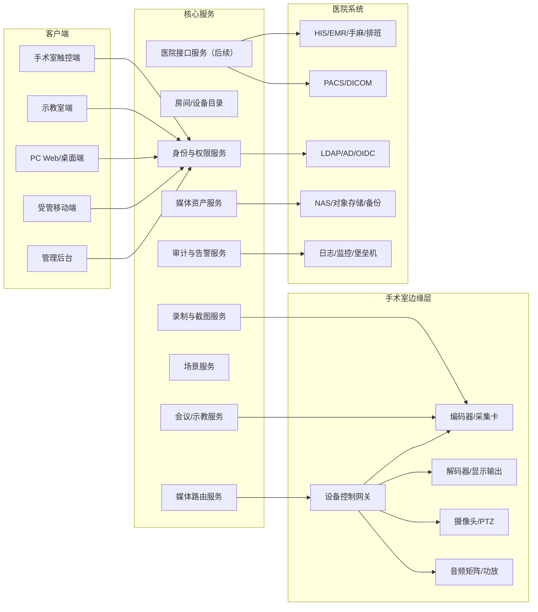

# 系统架构与接口设计

## 1. 架构目标

- 术中控制链路低延迟、高可靠、可降级。
- 视频、音频、会议、存档、设备控制和文档管理分层解耦。
- 支持院内私有化部署和多手术间扩展。
- 所有高风险操作可审计，所有患者媒体可追踪。
- 尽量使用标准协议，厂商私有 SDK 通过适配器隔离。

## 2. 逻辑架构

## 3. 组件设计

| 组件 | 职责 | 关键要求 |
| --- | --- | --- |
| 身份与权限服务 | 登录、令牌、角色、房间授权、操作授权 | 支持医院统一身份；最小权限；会话超时 |
| 房间/设备目录 | 管理房间、设备、输入源、输出源和在线状态 | 支持设备心跳、拓扑、禁用和维护状态 |
| 媒体路由服务 | 执行输入到输出的路由、断开、布局切换 | 幂等、低延迟、冲突检测、失败回滚 |
| 录制与截图服务 | 管理录制任务、截图、文件生成和状态 | 断点恢复、容量预警、完整性校验 |
| 会议/示教服务 | 创建会议、成员管理、音频控制、直播观看 | 加密、授权、只读观看和互动会议分离 |
| 媒体资产服务 | 文件索引、查询、回放、编辑、删除、下载 | 元数据一致性、权限、审计、保留期限 |
| 场景服务 | 场景编组、参数保存、应用和回滚 | 场景版本、影响预览、冲突提示 |
| 医院接口服务 | HIS/EMR/PACS/IAM/存储接口适配 | 当前 MVP 暂不接 HIS/EMR 患者信息；标准优先，接口隔离，重试和熔断 |
| 审计与告警服务 | 操作日志、系统事件、告警、报表 | 不可篡改、集中存储、导出 |
| 设备控制网关 | 对接编码器、解码器、PTZ、音频矩阵、显示器 | 厂商 SDK 隔离，支持模拟器测试 |

## 4. 部署建议

### 4.1 MVP 单院区部署

- 中心服务器：核心服务、数据库、媒体资产服务、管理后台。
- 存储服务器：NAS/对象存储，录制文件和截图。
- 手术室边缘节点：设备控制网关、媒体采集/编码代理。
- 示教室节点：解码、直播观看、会议终端。
- 监控和审计：接入医院日志平台或独立监控节点。

### 4.2 高可用增强

- 核心服务容器化部署，至少双节点。
- 数据库主备或集群，开启定期备份和恢复演练。
- 录制存储使用 RAID、对象存储或双写策略。
- 关键手术间可部署边缘缓存，中心服务异常时保留本地路由和录制能力。

## 5. 接口设计

### 5.1 REST API 示例

| 方法 | 路径 | 用途 |
| --- | --- | --- |
| `GET` | `/api/rooms` | 获取授权房间 |
| `GET` | `/api/rooms/{roomId}/sources` | 获取输入源 |
| `GET` | `/api/rooms/{roomId}/outputs` | 获取输出源 |
| `POST` | `/api/routes` | 创建路由 |
| `DELETE` | `/api/routes/{routeId}` | 断开路由 |
| `POST` | `/api/layouts/apply` | 应用 PIP/PBP 布局 |
| `POST` | `/api/clinical/patients` | 手动创建或保存合成患者 |
| `POST` | `/api/clinical/surgeries` | 手动创建或保存合成手术 |
| `POST` | `/api/recordings` | 开始录制 |
| `POST` | `/api/recordings/{id}/pause` | 暂停录制 |
| `POST` | `/api/recordings/{id}/resume` | 恢复录制 |
| `POST` | `/api/recordings/{id}/stop` | 停止录制 |
| `POST` | `/api/snapshots` | 截图 |
| `GET` | `/api/assets` | 检索媒体文件 |
| `POST` | `/api/conferences` | 创建会议 |
| `POST` | `/api/scenes/{id}/apply` | 应用场景 |

### 5.2 事件主题

| 主题 | 事件 |
| --- | --- |
| `device.status` | 设备上线、离线、故障、维护中 |
| `route.changed` | 路由创建、断开、失败 |
| `recording.status` | 开始、暂停、恢复、停止、异常 |
| `conference.status` | 创建、加入、退出、关闭、成员变更 |
| `asset.changed` | 新文件、编辑、删除、导出 |
| `alert.raised` | 容量不足、链路异常、权限异常 |

### 5.3 医院接口

| 接口 | 首选标准 | 替代方案 | 风险 |
| --- | --- | --- | --- |
| 患者和排班 | HL7 v2、FHIR | 数据库视图、WebService、厂商 API | 当前 MVP 暂不接入；字段差异和接口稳定性待现场确认 |
| 影像 | DICOM、DICOMweb、IHE | PACS 厂商 SDK | 兼容性和授权 |
| 身份认证 | LDAP/AD、OIDC、SAML | 本地账号 | 弱口令和账号生命周期 |
| 存储 | S3、NAS、SMB/NFS | 本地磁盘 | 容量、备份、勒索风险 |
| 设备控制 | ONVIF、VISCA、厂商 SDK | 串口/红外/私有协议 | 厂商锁定、模拟测试困难 |

## 6. 数据模型草案

| 表/集合 | 关键字段 |
| --- | --- |
| `users` | id, username, display_name, auth_source, status |
| `roles` | id, name, permissions |
| `rooms` | id, name, type, location, status |
| `devices` | id, room_id, type, vendor, model, ip, status, firmware |
| `sources` | id, room_id, device_id, name, type, stream_uri, status |
| `outputs` | id, room_id, device_id, name, type, status |
| `routes` | id, source_id, output_id, layout_id, status, created_by, created_at |
| `patients` | id, medical_record_no, name, sex, age, department, source_system |
| `surgeries` | id, patient_id, room_id, procedure_name, surgeon, scheduled_at |
| `recordings` | id, surgery_id, source_id, status, started_at, stopped_at, mute_state |
| `assets` | id, surgery_id, type, path, checksum, size, duration, retention_until |
| `conferences` | id, room_id, name, owner_id, status, access_mode |
| `scenes` | id, room_id, group_name, name, payload, version |
| `audit_logs` | id, actor_id, action, target_type, target_id, result, ip, created_at |
| `alerts` | id, severity, source, message, status, created_at, resolved_at |

## 7. 架构决策记录

| ADR | 决策 | 理由 |
| --- | --- | --- |
| ADR-001 | 将厂商设备协议封装到设备控制网关 | 降低硬件替换和模拟测试成本 |
| ADR-002 | 媒体文件与元数据分离存储 | 便于大文件扩展、权限和审计管理 |
| ADR-003 | 会议互动和只读直播分离 | 降低术中误操作和外部访问风险 |
| ADR-004 | 场景应用采用事务化编排 | 避免半成功状态影响术中安全 |

## 8. 设备清单与电气连接开发说明

基于 `数字化手术室连线图.vsdx` 的结构化解析，项目新增 [设备清单与电气连接设计](./13_设备清单与电气连接设计.md)，作为设备目录、路由配置、现场实施和联调测试的开发输入。

开发实现时需要将连线图转换为系统配置对象：

- 房间：手术室端、示教报告厅、远程示教端、服务器侧。
- 设备：视频矩阵、编码板、解码主机、光端机、交换机、控制主机、显示器、摄像头、音频设备、应用服务器、存储服务器。
- 连接：HDMI/视频线、LAN 网线、音频线、光纤线、USB 线。
- 端口：矩阵输入/输出、编码板输入/环出、主机信息网/设备网、服务器业务网口/存储网口。

软件侧应支持按设备编号和连接编号维护配置，并在联调时输出设备在线状态、信号状态、端口占用、链路异常和存储可用性。强电供电、UPS、PDU 和接地未在图纸中展示，需作为实施确认项纳入现场检查。
