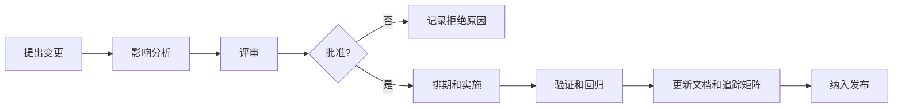

# 质量、配置、变更与发布管理计划

## 1. 质量目标

- 需求、设计、风险、测试、缺陷和发布记录可追踪。
- P0/P1 需求必须有可执行测试或人工验收记录。
- 医疗数据、安全、权限、审计和录制可靠性相关缺陷不得以未评估状态进入正式开放。
- 每次发布都有可回滚路径和运维交接材料。

## 2. 质量保证活动

| 活动 | 频率 | 输出 |
| --- | --- | --- |
| 需求评审 | 需求冻结和重大变更时 | 评审纪要、问题清单 |
| 架构评审 | 架构冻结和关键技术变更时 | ADR、风险更新 |
| 安全评审 | 每个版本发布前 | 安全扫描、权限测试、整改记录 |
| 测试评审 | 测试计划和测试报告完成后 | 测试覆盖和缺陷结论 |
| 发布评审 | 每次试运行或正式发布前 | 发布审批、回滚方案 |
| 复盘 | 重大缺陷或试运行结束后 | 根因分析、改进项 |

## 3. 配置项管理

| 配置项 | 管理方式 |
| --- | --- |
| 源代码 | Git 分支、受保护主干、代码评审 |
| 文档 | `docs/` 版本化，重大版本打标签 |
| API 契约 | OpenAPI/AsyncAPI/接口字段表版本化 |
| 数据库脚本 | 迁移脚本编号、可重复执行、回滚说明 |
| 设备配置 | 房间、输入源、输出源、场景配置导出备份 |
| 部署配置 | 环境变量、证书、密钥引用、配置模板 |
| 第三方依赖 | 锁文件、SBOM、许可证和漏洞扫描 |
| 测试数据 | 脱敏或模拟数据，禁止真实患者数据 |

## 4. 变更控制流程

变更影响分析至少覆盖：

- 产品范围和用户流程。
- 医疗用途声明。
- 安全、隐私、权限和审计。
- HIS/EMR/PACS/设备接口。
- 数据库、存储、迁移和回滚。
- 测试范围、培训材料和开放检查项。

## 5. 分支和版本建议

| 分支/标签 | 用途 |
| --- | --- |
| `main` | 始终保持可发布或已发布状态 |
| `develop` | 集成分支，进入系统测试前冻结 |
| `feature/FR-xxx-*` | 功能开发分支 |
| `fix/BUG-xxx-*` | 缺陷修复分支 |
| `release/vX.Y.Z` | 发布候选分支 |
| `vX.Y.Z` | 正式发布标签 |

版本号建议采用 `主版本.次版本.修订号`：

- 主版本：架构、数据模型或产品边界重大变化。
- 次版本：新增功能或接口。
- 修订号：缺陷修复、安全补丁或小范围优化。

## 6. 代码评审要求

每次合并至少检查：

- 是否关联需求、缺陷或风险编号。
- 是否更新测试。
- 是否影响权限、审计、隐私、导出、会议外部访问或存储。
- 是否有异常处理、重试、超时、幂等和回滚。
- 是否引入新依赖、许可证或安全风险。
- 是否更新接口文档、数据迁移和运维说明。

## 7. 发布包内容

正式开放发布包至少包含：

- 应用镜像或安装包。
- 数据库迁移脚本和回滚说明。
- 部署配置模板。
- 版本发布说明。
- 已知问题和风险接受清单。
- 安全扫描、测试报告、UAT 报告。
- 备份恢复和回滚演练记录。
- 用户手册、运维手册、培训记录。
- 更新后的追踪矩阵和开放检查清单。

## 8. 发布流程

1. 生成 release 分支和版本号。
2. 冻结需求和代码范围。
3. 执行自动化测试、集成测试、性能测试和安全测试。
4. 完成发布评审和风险接受。
5. 备份生产配置和数据。
6. 部署发布包。
7. 执行冒烟测试和关键场景测试。
8. 进入观察期。
9. 归档发布证据。

## 9. 质量度量

| 指标 | 目标 |
| --- | --- |
| P0 需求测试覆盖 | 100% |
| P0/P1 缺陷开放数 | 正式开放前 0 |
| 安全高危漏洞 | 正式开放前 0 |
| 需求到测试追踪覆盖 | 100% |
| 发布回滚演练 | 每个正式发布前至少 1 次 |
| 备份恢复演练 | 试运行前和正式开放前各 1 次 |
| 用户培训覆盖 | 授权用户和管理员 100% |

## 10. 文档控制

文档修改必须记录版本、日期、作者、变更摘要和影响范围。正式开放前建议为本文件夹打发布标签，并导出一份不可编辑归档版。
