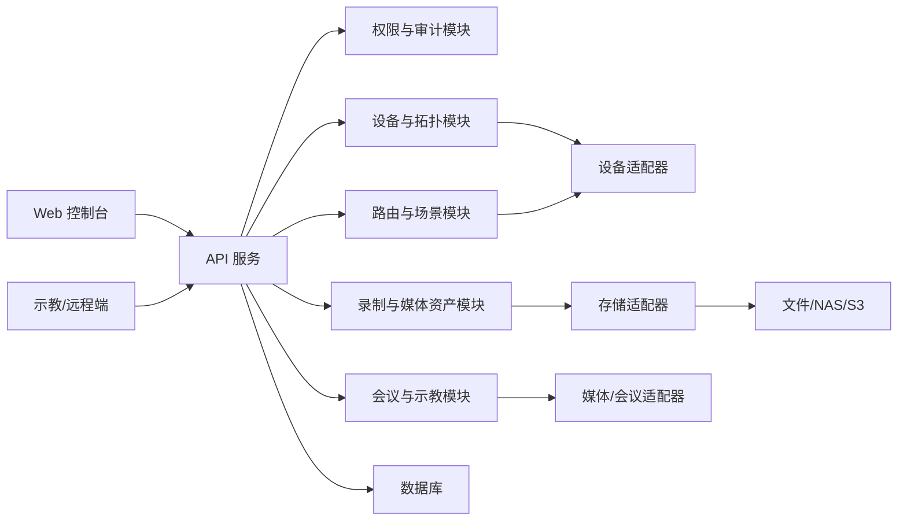

# 技术实施路线图

版本：0.1
日期：2026-06-29
目标：为第一版 MVP 开发确定技术路线、架构分层、迭代顺序和关键验证点。

## 1. 技术目标

第一版技术实现应优先证明四件事：

- 真实手术室工程经验能被抽象为稳定的数据模型和配置系统。
- 软件可以围绕设备、端口、连接和路由建立可视化控制闭环。
- 录制、存储、回放、示教和远程访问可以在权限和审计约束下运行。
- 后续接入真实矩阵、编码板、解码器、摄像头、音频设备和医院接口时，不需要推翻业务层。

## 2. 推荐技术栈

| 层级 | 推荐方案 | 选择理由 |
| --- | --- | --- |
| 前端 | React + TypeScript + Vite | 适合触控控制台、管理后台和示教端快速迭代 |
| 后端 | Node.js + TypeScript + NestJS 或 Fastify | 便于建立模块化 API、WebSocket、权限和设备适配层 |
| 数据库 | PostgreSQL，开发期可用 SQLite | 适合结构化配置、审计、任务状态和查询 |
| ORM/迁移 | Prisma 或 Drizzle | 数据模型清晰，便于迁移和种子数据管理 |
| 实时通信 | WebSocket 或 Server-Sent Events | 推送设备状态、路由变化、录制状态和告警 |
| 媒体处理 | MVP 使用模拟流和文件适配器，后续接入 FFmpeg/GStreamer/WebRTC/SRT | 先验证业务闭环，再处理真实媒体复杂度 |
| 存储 | 本地文件开发适配器 + S3 兼容接口预留 | 可迁移到 NAS、对象存储或医院指定存储 |
| 部署 | Docker Compose | 便于本地演示、测试环境和现场试部署 |
| 测试 | Vitest/Jest、Playwright、API 集成测试 | 覆盖模型、接口、权限和关键 UI 流程 |

若团队已有成熟技术栈，可以保留前后端分层、适配器隔离和自动化测试原则，替换具体框架。

## 3. 架构分层

核心原则：

- UI 不直接操作硬件，只调用后端业务 API。
- 业务层不绑定具体厂商设备，通过适配器调用真实硬件或模拟设备。
- 设备配置和连接关系进入数据库，避免写死在页面代码中。
- 所有路由、录制、下载、删除、配置变更都写审计日志。
- 真实媒体流、会议网关和医院接口可以逐步替换 Mock 实现。

## 4. 核心数据模型

| 模型 | 说明 | 来源 |
| --- | --- | --- |
| Room | 手术室端、示教报告厅、远程示教端、服务器侧 | 13_设备清单与电气连接设计 |
| Device | 视频矩阵、编码板、解码主机、光端机、交换机、控制主机、显示器、摄像头、音频设备、服务器 | 13_设备清单与电气连接设计 |
| Port | 设备输入、输出、网络口、音频口、USB 口、电源确认项 | 13_设备清单与电气连接设计 |
| Connection | HDMI、LAN、音频线、光纤、USB、服务器网络链路 | TC-CONN-001..010 |
| SignalSource | DSA/CT、腔镜、术野、全景、监护仪、其他视频源、会议输入 | FR-002 |
| DisplayTarget | 床旁显示器、65 寸显示器、85 寸 4K 大屏、示教屏幕、远程端 | FR-003 |
| RouteSession | 当前输入源到输出端的分配关系 | FR-003 |
| LayoutTemplate | PIP/PBP、四分屏、示教布局 | FR-005 |
| RecordingTask | 录制任务状态机 | FR-007 |
| MediaAsset | 视频、截图、元数据、存储位置和权限 | FR-010 |
| MeetingSession | 示教和远程会议 | FR-009 |
| AuditLog | 登录、路由、录制、下载、删除、配置变更 | FR-013 |
| Alert | 设备离线、信号异常、存储不足、自检失败 | FR-014 |

## 5. API 边界

| API 域 | 典型接口 | 优先级 |
| --- | --- | --- |
| Auth | 登录、退出、当前用户、角色权限、房间授权 | P0 |
| Rooms | 房间列表、房间详情、房间设备拓扑 | P0 |
| Devices | 设备列表、设备详情、端口、状态、连接 | P0 |
| Routing | 创建路由、断开路由、当前路由、冲突检查 | P0 |
| Layouts | 布局模板保存、应用、复制、删除 | P0 |
| Patients | 患者查询、手动创建、手术信息关联 | P0 |
| Recording | 开始、暂停、恢复、停止、状态查询 | P0 |
| Media | 文件查询、详情、回放地址、下载、删除 | P0 |
| Teaching | 示教会话、观看授权、只读直播状态 | P0 |
| Meetings | 创建会议、邀请成员、移除成员、关闭会议 | P0 |
| Audit | 操作日志查询、导出 | P0 |
| Alerts | 告警列表、确认、状态历史 | P1 |
| System | 参数配置、版本、开机时长、存储容量 | P1 |

## 6. 迭代路线

### Phase 0：工程准备

目标：让项目具备可持续开发能力。

交付：

- Monorepo 或清晰的前后端目录结构。
- 本地启动、环境变量、数据库迁移和种子数据。
- 代码格式、类型检查、单元测试和基础 CI。
- 第一批标准版拓扑种子数据。

### Phase 1：配置和拓扑

目标：把连线图转成软件可管理的配置。

交付：

- 房间、设备、端口、连接、服务器和存储模型。
- 设备清单和连接清单页面。
- 设备在线、离线、信号异常、端口占用的模拟状态。
- `TC-CONN-001` 和 `TC-CONN-010` 对应验收清单。

### Phase 2：路由和控制台

目标：完成视频源到显示端的路由闭环。

交付：

- 输入源、输出端和路由会话模型。
- 路由创建、断开、冲突检测和审计日志。
- 手术室控制台第一版 UI。
- PIP/PBP 布局模板。

### Phase 3：录制和媒体资产

目标：完成手术资料归档的最小闭环。

交付：

- 患者/手术信息手动录入和 Mock 查询。
- 录制任务状态机。
- 存储卷、容量状态、媒体文件元数据。
- 媒体库查询、回放入口和下载审计。

### Phase 4：示教和远程访问

目标：完成示教报告厅和远程端的授权观看。

交付：

- 示教会话和只读观看模式。
- 会议会话、成员、邀请、移除、关闭。
- 远程端设备类型和访问授权。
- 音频输入输出配置和静音状态管理。

### Phase 5：质量、运维和发布

目标：形成可演示、可验收、可继续接真实硬件的 MVP。

交付：

- 自动化测试最小集合。
- 告警、状态历史、自检和运维页面。
- Docker Compose 部署和备份恢复说明。
- MVP 发布说明、开放检查清单和演示脚本。

## 7. 技术风险和验证点

| 风险 | 验证方式 | MVP 策略 |
| --- | --- | --- |
| 真实媒体链路延迟不可控 | 媒体 PoC、延迟采样、现场网络测试 | 业务层先模拟，适配层预留真实媒体接入 |
| 设备协议差异大 | 设备适配器接口和 Mock 驱动 | 不把厂商协议写入核心业务 |
| 存储容量和文件完整性 | 长时间录制、断点恢复、容量告警测试 | 开发期使用文件适配器，保留 S3/NAS 接口 |
| 权限误操作影响术中安全 | RBAC、房间授权、只读模式、审计 | 所有控制类操作默认需要授权 |
| 医院接口周期不可控 | Mock HIS/EMR/PACS、手动录入降级 | 先做手动录入和接口占位 |
| 公开仓库敏感信息泄露 | `.gitignore`、脱敏扫描、提交前检查 | 原始图纸、PDF、密钥和配置不提交 |

## 8. 开工 Definition of Ready

进入编码前需满足：

- MVP 任务清单已评审，P0 范围达成一致。
- 技术栈、目录结构和数据库方案确认。
- 设备拓扑种子数据字段确认。
- 首批页面信息架构确认：控制台、设备拓扑、媒体库、示教端、审计。
- Mock 设备、Mock 媒体流、Mock 患者接口方案确认。
- 提交规范、分支策略、测试命令和发布检查清单确认。

## 9. MVP Definition of Done

MVP 完成需满足：

- P0 任务完成并通过代码评审。
- `FR-001` 到 `FR-014` 的 MVP 部分均有实现或明确降级说明。
- `TC-CONN-001` 到 `TC-CONN-010` 有可执行验收记录。
- 至少完成一次从设备配置、路由、录制、媒体查询、示教观看到审计追踪的端到端演示。
- 无原始图纸、厂商资料、密钥、生产配置或患者数据进入仓库。
- README、部署说明、测试说明和发布说明同步更新。
